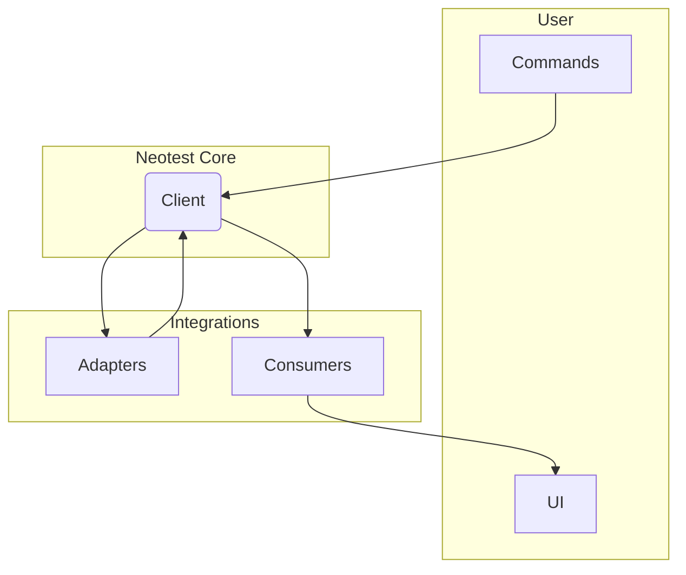
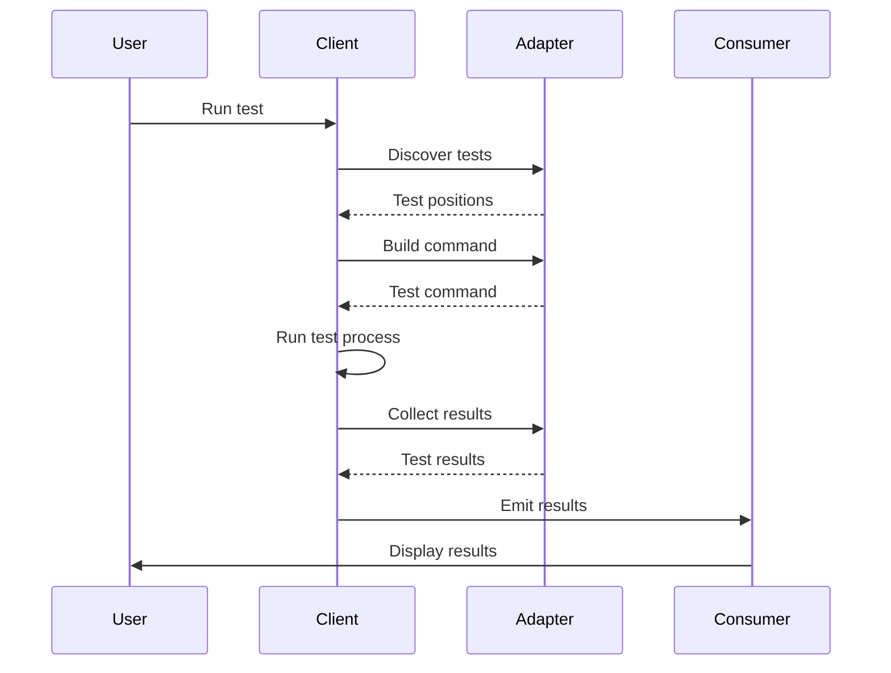

# Neotest Architecture

This document provides an overview of the Neotest architecture to help developers understand how the different components interact.

## High-Level Architecture

The architecture of Neotest is centered around three main components: the **Client**, **Adapters**, and **Consumers**.



- **Client**: The central component of Neotest. It acts as an orchestrator,
  managing the state of tests, running test processes, and processing results. It
  communicates with adapters to discover and run tests, and it emits events that
  are handled by consumers to present the results to the user.

- **Adapters**: These are responsible for interfacing with specific test
  runners (e.g., `pytest`, `jest`, `go test`). Each adapter implements an
  interface that allows the client to discover tests, build commands to run them,
  and parse the results. This modular design makes Neotest extensible to support
  a wide variety of test frameworks.

- **Consumers**: These are the user-facing components of Neotest. They
  consume the data and events from the client to provide various features, such
  as displaying test results in a summary window, showing status signs in the
  gutter, and providing diagnostic messages.

## Key Components

### 1. Adapters

Adapters are the bridge between Neotest and testing frameworks. Each adapter handles:

- Project root detection
- Test file identification
- Test discovery and parsing
- Command generation for running tests
- Result parsing

Adapters must implement the interface defined in `lua/neotest/adapters/interface.lua`.

### 2. Client

The client (`lua/neotest/client/`) is the core of Neotest, responsible for:

- Managing the adapter group
- Building and maintaining the test tree
- Running tests using strategies
- Tracking test results
- Emitting events for consumers

Key files:
- `init.lua`: Main client implementation
- `positions.lua`: Position tree handling
- `runner.lua`: Test running functionality
- `strategies/`: Test run strategies

### 3. Consumers

Consumers provide user-facing functionality to interact with tests:

- `run.lua`: Commands to run tests
- `summary.lua`: Tree view of tests
- `output.lua`: Test output display
- `diagnostic.lua`: Integration with Neovim diagnostics
- `status.lua`: Signs for test status
- `jump.lua`: Navigation between tests

### 4. Library Functions

The `lua/neotest/lib/` directory contains shared utilities:

- `treesitter/`: Test parsing using Treesitter
- `file/`: File and directory operations
- `positions/`: Position tree manipulation
- `process/`: Process handling
- `ui/`: UI components

## Data Flow

The following diagram illustrates the data flow within Neotest when running a test.



1. **Test Execution**: The user initiates a test run via a command.
2. **Test Discovery**: The client asks the appropriate adapter to discover
   tests in the current file or directory. The adapter returns a tree of test
   positions.
3. **Command Building**: The client asks the adapter to build a command to run
   the specified test(s).
4. **Process Execution**: The client executes the test command in a separate process.
5. **Result Collection**: The client asks the adapter to collect the results
   from the test process's output.
6. **Event Emission**: The client emits events with the test results.
7. **Result Display**: Consumers listen for these events and update the UI to
   display the results to the user.

### Test Discovery Flow

1. User requests test discovery (explicitly or implicitly)
2. Client determines which adapter to use
3. Adapter's `is_test_file` method checks if files are test files
4. Adapter's `discover_positions` method parses test files
5. Client builds a position tree representing the test structure
6. Consumers display the test structure to the user

### Test Execution Flow

1. User requests to run tests
2. Client finds the appropriate adapter for the tests
3. Adapter's `build_spec` method generates commands
4. Client runs the commands using the selected strategy
5. Strategy executes the commands and captures output
6. Adapter's `results` method parses the output
7. Client updates the test results
8. Client emits events to notify consumers
9. Consumers update their UI with the results

## Event System

Neotest uses an event system to communicate between components:

1. **Client Events**:
   - `discover`: Emitted when tests are discovered
   - `run`: Emitted when tests are run
   - `results`: Emitted when test results are updated
   - `test_file_focused`: Emitted when a test file gets focus

2. **Consumer Listeners**:
   Consumers register listeners for events they're interested in.

## Position Tree

The position tree is a core data structure in Neotest, representing the hierarchy of:
- Files
- Namespaces
- Tests

Each position has:
- `id`: Unique identifier
- `type`: Type of position (file, namespace, test)
- `path`: File path
- `name`: Name of the position
- `range`: Range of lines in the file

## Strategies

Strategies are methods to run tests:

1. **integrated**: Default strategy, runs tests in the background
2. **dap**: Uses nvim-dap to debug tests

Custom strategies can be added by implementing the strategy interface.

## Configuration System

Neotest uses a layered configuration system:
- Default config in `lua/neotest/config/init.lua`
- User config provided in `setup()`
- Project-specific configs with `setup_project()`

## API Design

Neotest exposes a public API through the main module:

```lua
local neotest = require("neotest")

-- Consumer APIs
neotest.run.run()
neotest.summary.open()
neotest.output.open()
```

Each consumer's API is documented in the respective files.

## Extension Points

Neotest can be extended in several ways:

1. **Adapters**: New testing frameworks
2. **Strategies**: New ways to run tests
3. **Consumers**: New UI components or integrations

## Performance Considerations

Neotest uses several techniques for performance:

1. **Async operations**: Non-blocking operations
2. **Caching**: Cached test discovery
3. **Selective updates**: Only update what's needed
4. **Lazy loading**: Load components on demand

## Security Model

Neotest runs commands on the user's system, so security is important:

1. Adapters should sanitize inputs to commands
2. Strategies should handle command execution safely
3. Configuration should be validated
